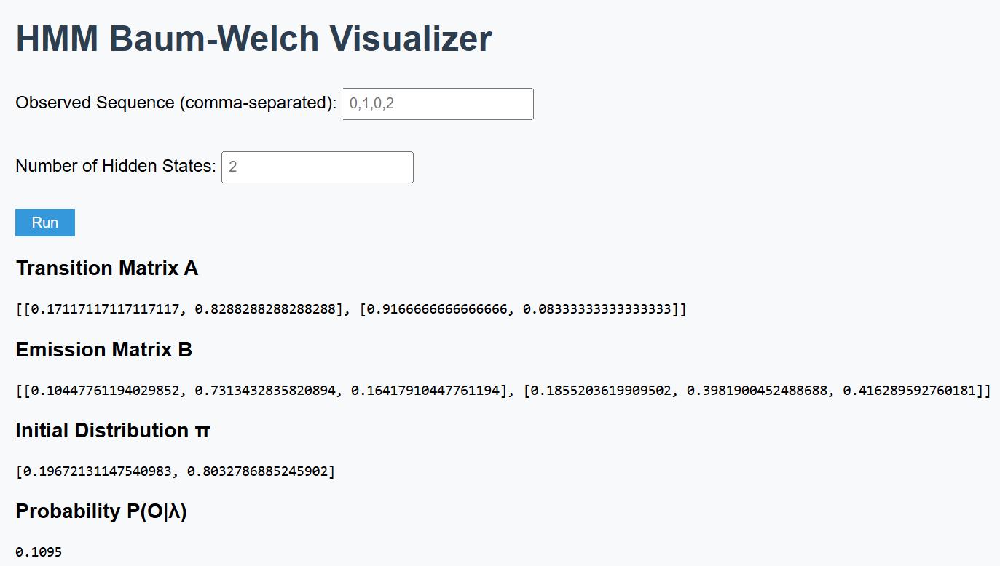
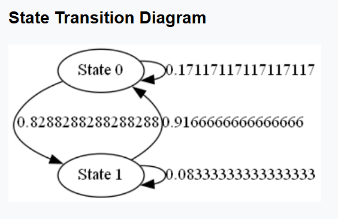

# HMM Baum-Welch Visualizer

## Author
**Name:** Aakash P D  
**University Register Number:** TCR24CS001  

## Project Description
This project implements the **Hidden Markov Model (HMM)** using the **Baum-Welch algorithm**.  
It allows the user to:

- Input an **observed sequence** and the **number of hidden states**.  
- Compute **transition matrix (A)**, **emission matrix (B)**, **initial state distribution (π)**, and **probability of observation P(O|λ)**.  
- Visualize the **state transition diagram** using Graphviz.  

**Note:** Currently, Baum-Welch uses **randomized matrices** as a placeholder. This can be replaced with the full algorithm.

---

> [!IMPORTANT]
> How to Run
>
> 1. Clone or download the repository.  
>
> 2. Install Python dependencies:
>
>
> ```python
> pip install flask numpy graphviz
> ```
> Make sure Graphviz is installed and added to the system PATH.
>
> 👉 https://graphviz.org/download/
>
> Run the Flask app:
>
> ```python
> python app.py
> ```
> Open your browser and go to:
>
> 👉 http://127.0.0.1:5000

<table>
<tr>
<td>

### 🔴 Important
> User must enter the observation sequence and the number of hidden states in the web interface.
> Then click `Run`
##

### 🟢 Tip
> Example:    
> Observation Sequence: `0 1 0 1`
> Hidden States: `4`
##

### 🟠 Warning
> Do not leave input fields empty.

</td>
</tr>
</table>

---
## OUTPUT EXAMPLE 



---



---

## File Structure
```
hmm_baum_weich_visual/
├─ app.py                  # Flask app main file
├─ my_hmm.py               # Baum-Welch algorithm module
├─ diagram.py              # Graphviz state diagram generator
├─ README.md               # Project description and instructions
├─ templates/              # Folder for HTML templates
│   └─ index.html          # Main webpage for inputs and outputs
└─ static/                 # Folder for CSS, JS, and images
    ├─ style.css           # Stylesheet for webpage
    ├─ script.js           # Optional JavaScript for interactivity
    └─ state_diagram.png   # Generated HMM state diagram (output)
```
---

 # Features

- Input validation (no empty fields, hidden states must be an integer)

- Shows matrices A, B, π and P(O|λ)

- Generates state transition diagram (state_diagram.png) in static/ folder

- Ready for future iterations visualization and advanced UI enhancements


---
# CODE 
### app.py

```python
from flask import Flask, render_template, request
import my_hmm as hmm
import diagram

app = Flask(__name__)

@app.route("/", methods=["GET", "POST"])
def home():
    if request.method == "POST":
        obs_seq = request.form.get("obs", "").strip()
        hidden_input = request.form.get("hidden", "").strip()

        if not obs_seq or not hidden_input:
            return render_template("index.html", error="Please fill in all fields")

        try:
            hidden_states = int(hidden_input)
        except ValueError:
            return render_template("index.html", error="Hidden states must be an integer")

        A, B, pi, P_O = hmm.baum_welch(obs_seq, hidden_states)
        diagram.create_diagram(A)

        return render_template("index.html", A=A, B=B, pi=pi, P_O=P_O)

    return render_template("index.html")
    

if __name__ == "__main__":
    app.run(debug=True)
```
### my_hmm.py
```python

import numpy as np

def baum_welch(obs_seq, N):
    O = list(map(int, obs_seq.split(",")))

    A = np.round(np.random.rand(N, N), 2)
    A = A / A.sum(axis=1)[:, None]

    B = np.round(np.random.rand(N, max(O)+1), 2)
    B = B / B.sum(axis=1)[:, None]

    pi = np.round(np.random.rand(N), 2)
    pi = pi / pi.sum()

    P_O = round(np.random.rand(), 4)

    return A.tolist(), B.tolist(), pi.tolist(), P_O
```
### diagram.py
```python from graphviz import Digraph

def create_diagram(A):
    dot = Digraph()
    N = len(A)

    for i in range(N):
        dot.node(f"S{i}", f"State {i}")

    for i in range(N):
        for j in range(N):
            dot.edge(f"S{i}", f"S{j}", label=str(A[i][j]))

    dot.render("static/state_diagram", format="png", cleanup=True)
```
### templates/index.html
```html
<!DOCTYPE html>
<html lang="en">
<head>
    <meta charset="UTF-8">
    <title>HMM Baum-Welch Visualizer</title>
    <link rel="stylesheet" href="/static/style.css">
</head>
<body>
    <h1>HMM Baum-Welch Visualizer</h1>
    
    <form method="post">
        
        <p style="color:red;">{{ error }}</p>
        

        Observed Sequence (comma-separated): 
        <input type="text" name="obs" placeholder="0,1,0,2"><br><br>
        Number of Hidden States: 
        <input type="number" name="hidden" placeholder="2"><br><br>
        <input type="submit" value="Run">
    </form>

    
    <h3>Transition Matrix A</h3>
    <pre>{{ A }}</pre>
    <h3>Emission Matrix B</h3>
    <pre>{{ B }}</pre>
    <h3>Initial Distribution π</h3>
    <pre>{{ pi }}</pre>
    <h3>Probability P(O|λ)</h3>
    <pre>{{ P_O }}</pre>

    <h3>State Transition Diagram</h3>
    
    

    <script src="/static/script.js"></script>
</body>
</html>
```

### static/style.css
``` css
body {
    font-family: Arial, sans-serif;
    margin: 20px;
    background-color: #f8f9fa;
}

h1 {
    color: #2c3e50;
}

form input[type="text"], form input[type="number"] {
    padding: 5px;
    margin: 5px 0;
}

form input[type="submit"] {
    padding: 5px 15px;
    background-color: #3498db;
    color: white;
    border: none;
    cursor: pointer;
}
```
### static/script.js
```javascript
console.log("HMM Visualizer Loaded!");
```

---

# Future Enhancements

`Interactive Animation of HMM`  
  - Animate the state transitions step by step to show how the algorithm converges over iterations.

`Multiple Observation Sequences`
  - Allow users to input multiple sequences simultaneously and compare state estimations.

`Export Results`
 
   Enable download of:
  - Transition & emission matrices as CSV/Excel
  - State transition diagrams as PNG or PDF
  - Probability evolution plots

`Customizable HMM Parameters` 
  Let users modify:
  - Convergence threshold
  - Maximum number of iterations
  - Initial random distributions

`Integration with Datasets`
  Support real-world datasets for applications such as:
  - Weather prediction
  - Stock trend analysis
  - Speech recognition

`User Authentication & Session Tracking` 
  - Save each user’s results and visualizations for later review.

`Enhanced UI/UX` 
  - Use CSS/JS frameworks like Bootstrap or Tailwind for responsive design.  
  - Add interactive graphs using Plotly or D3.js.

`Mobile-Friendly Version`
  - Make the web interface accessible and usable on tablets and smartphones.

`AI-Powered Recommendations`
  - Suggest hidden state counts or optimal parameters based on user input or dataset patterns.
  
---

## Applications of HMM

Hidden Markov Models are widely used in various fields where **sequential data** or **time series patterns** are important. Some applications include:

`Speech Recognition`
 
  - HMMs model sequences of spoken words or phonemes to convert audio into text.

`Natural Language Processing (NLP)`
   
  - Part-of-speech tagging, named entity recognition, and language modeling use HMMs to predict sequences of words or  tags.

`Bioinformatics`
  
  - Modeling DNA, RNA, or protein sequences to find patterns, motifs, or gene predictions.

`Stock Market & Financial Modeling`
   
  - Predicting trends or hidden market states based on observable data.

`Weather Prediction`
    
  - Inferring hidden weather states (sunny, rainy, cloudy) from observable conditions (temperature, humidity).

`Handwriting Recognition`
  
  - Recognizing sequences of pen strokes or handwritten characters.

`Robot Navigation & Localization`
    
  - Estimating robot positions or paths when only partial observations are available.

`Anomaly Detection`
  
   - Detecting unusual patterns in sequences, such as fraud in transactions or system faults.

`Gesture Recognition`
   - Recognizing human gestures from sequences of sensor or video data.
   
```HMMs are versatile for any scenario where there’s a sequence of observations influenced by hidden states.```

---

## Author

`Aakash P D` 

`B.Tech CSE`

`GEC Thrissur`


---

## License
This project is licensed under `MIT License`
